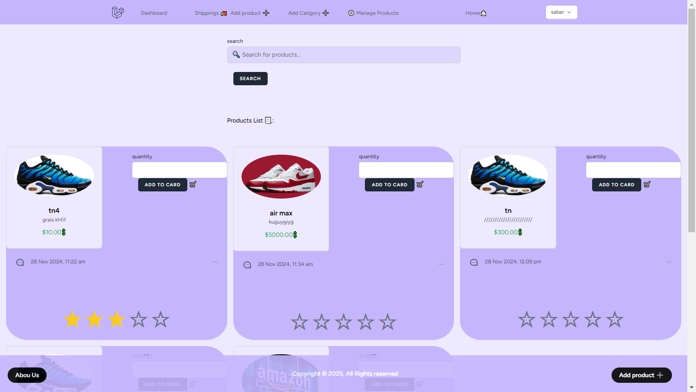

# Web Development Project




## Setup Instructions

Follow these steps to set up and run the project on your local machine.

### 1. Import the Database
Import the provided SQL file to create the database.

### 2. Install Dependencies
Run the following command to install PHP dependencies:
```sh
composer install
```

### 3. Start the Server
Run the Laravel development server:
```sh
php artisan serve
```

### 4. Run Frontend Assets
Compile frontend assets using:
```sh
npm run dev
```

### 5. Start MySQL
Make sure MySQL is running before accessing the application.

---
✅ Now you can access the project at `http://127.0.0.1:8000/`
STRIPE_KEY=your-public-key-here
STRIPE_SECRET=your-secret-key-here

---

## Admin Credentials

Email: sa@gmail.com

Password: 00000000
